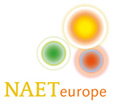

L’allergie est la sixième maladie mondiale. L’asthme et la rhinite allergique (rhume des foins) représentent 80 % des consultations en allergie et sont la première cause d’absentéisme dans les écoles. Les allergies continuent à se développer de plus en plus rapidement en touchant des populations de plus en plus jeunes, qui sont de plus en plus en contact avec les polluants industriels allergisants et autres allergènes présents dans l’alimentation trafiquée ! La population la plus touchée est celle des jeunes entre 18 et 24 ans, mais 12 % des bébés (moins de 2 ans) sont désormais allergisés dans notre pays.

## Traitement de l’allergie par la méthode naet (<em lang="en">Nambudripad’s Allergie Elimination Techniques</em>)

La méthode NAET est un assemblage de notions de médecine classique, de médecine chinoise, d’ostéopathie, de kinésiologie et de diététique. De façon identique, elle aborde les allergies, les intolérances, les hypersensibilités en impliquant la libération dans l’organisme des immunoglobulines (IgE)

La méthode NAET débouche sur un principe essentiel selon lequel la réaction allergique est en fait dictée par le cerveau, suivant la perception que celui-ci a de la substance en cause. Percevant cette dernière comme une menace pour l’organisme, le cerveau ordonne au système immunitaire de mobiliser ses défenses pour combattre « l’intrus », ce qui se traduit par la réaction allergique.

À partir de cette théorie, vérifiée par des milliers de cas traités, la méthode NAET comprend une **stimulation particulière des racines du système nerveux sympathique**, qui permet d’envoyer un message au cerveau, l’invitant à revenir sur sa perception erronée de la substance précise. Ce nouveau message s’imprimera définitivement après stimulation d’autres points d’acupuncture (par digitopuncture) et le respect de règles précises pendant quelques heures après le traitement.

**Après le traitement, le blocage d’énergie a totalement disparu** et il n’y aura plus trace d’allergie lorsque le patient sera à nouveau en contact avec son allergène.

La méthode NAET est indolore, sûre et très efficace lorsqu’elle est appliquée dans les règles de l’art. **Elle n’implique aucun recours à des médicaments.**

 [1]: ./images/logo_naet_petit.png
