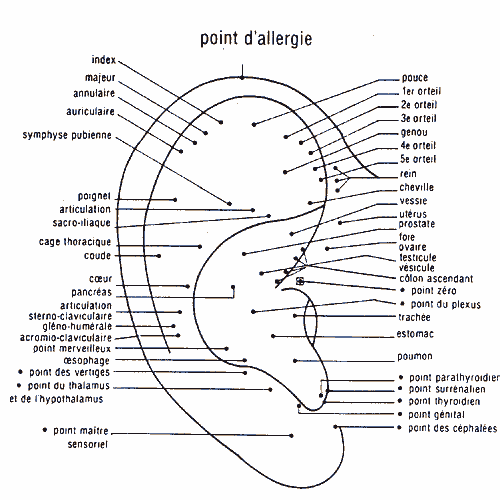

L’auriculothérapie est l’utilisation du pavillon auriculaire à des fins thérapeutiques. Cet emploi de l’oreille s’explique par une vascularisation très riche et une innervation sensitive dense et variée.

C’est une des techniques réflexes les plus évoluées, issue de la médecine traditionnelle chinoise. Son but est double : dépistage et traitement.

Une image du corps se projette sur le pavillon auriculaire. Elle est assez voisine de celle du fœtus, dont la tête se trouverait au bas de l’oreille, au niveau du lobule, tandis que les mains et les pieds seraient localisés au sommet de l’auricule.

Chaque point (estomac, foie, rein…) a une correspondance avec une partie du corps par voie réflexe au système nerveux de l’organe concerné. On stimule les points au moyen de micro-courants électriques de faible intensité (entre 5 et 10 micro-ampères) ou avec des aiguilles d’acupuncture.

L’auriculothérapie agit particulièrement dans les algies, c’est sa première indication. Toutes les douleurs, quelles qu’elles soient, peuvent être influencées, atténuées, soulagées et parfois effacées par le traitement au niveau de l’oreille.

Les indications de l’auriculothérapie ne se limitent pas seulement aux douleurs. Elle est conseillée dans les états de souffrance qui se manifestent au niveau du système nerveux par des crises d’anxiété ou de dépression. On peut ainsi agir sur un grand nombre de troubles fonctionnels qui, apparemment, ne peuvent être améliorés facilement par les procédés classiques (angoisse, agoraphobie, obsessions, manque de concentration, vertiges...).

**Il faut noter que l’on peut favoriser particulièrement le sevrage dans beaucoup d’intoxications telles que tabac, médicaments, drogues, etc.**

L’auriculothérapie peut rendre de grands services dans tous les cas où le malade a besoin d’un soulagement rapide. Ce peut être une médecine d’urgence, car c’est le moyen idéal pour améliorer, dans un premier temps, tous ceux qui ne peuvent recevoir les soins complexes de la médecine moderne. Par exemple, on peut employer l’auriculothérapie après un traumatisme ou en présence d’une crise aiguë de calculs.

Méthode simple, l’auriculothérapie permet, par sa facilité d’application, d’agir vite et d’être efficace. Elle apporte une aide sérieuse à toutes les autres thérapeutiques. Elle peut renforcer un traitement médicamenteux en agissant sur le métabolisme du médicament au niveau de son absorption ou de son élimination.

Cette technique n’est pas proposée dans le Centre de Naturopathie Lausanne.
