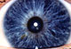
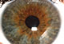

Établir un bilan de santé par l’iridologie n’est pas un diagnostic médical au sens légal du terme. Par contre, c’est une **extraordinaire méthode de dépistage et de prévention**.

La partie colorée de l’œil est comme un écran contrôle, le tableau synoptique de notre corps, qui permet de comprendre notre programme génétique et notre métabolisme.

L’examen de l’iris permet d’établir le panorama de votre potentiel vital, de l’hérédité, de votre tempérament, de l’état des organes, des déficiences, des déséquilibres et des carences éventuelles.

Au moyen d’un iridoscope (appareil binoculaire), d’une caméra vidéo ou encore d’une caméra numérique reliée à un ordinateur, l’iridologie consiste à analyser les structures de la trame irienne, les taches, les pigmentations et toutes les modifications de cette trame : c’est l’appréciation du terrain organique.

L’examen iridologique évalue donc votre capital santé : potentiel d’énergie et de réserves nerveuses. L’iridologie s’efforce avant tout de découvrir les causes profondes des troubles et des déficiences qui s’inscrivent souvent longtemps avant qu’un symptôme soit venu les signaler.

C’est une méthode qui permet d’identifier les ennuis de santé en les visualisant sur l’iris, et qui recherche à en découvrir l’origine.

**L’iridologie est ainsi un moyen de prévention personnalisé, précieux et efficace.**

&nbsp;

	

		
	

	

		
	

	

		
	

	

		
	

