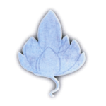

<h2>Le détachement</h2>

Il s’agit de couper les liens de dépendance qui nous empêchent d’être nous-mêmes. 
Ils nous alourdissent, ralentissent notre démarche. 
Il est nécessaire d’être libre pour que notre amour ne soit pas un amour de marchandage. 
(Voir Phillys Cristal)

Première étape : durant 15 jours au minimum, quelques minutes avant de vous lever et avant de vous coucher, visualiser un lemniscate, un huit : soit deux cercles reliés par un point, qui se touchent à un endroit, comme des tubes creux dans lesquels circule une lumière : vous vous visualiserez dans le premier cercle, assis à même le sol et vous imaginerez face à vous la personne avec laquelle vous allez faire la pratique du détachement. 
La lumière va circuler dans le sens des aiguilles d’une montre autour de vous et dans le sens contraire autour de la personne. Cela forme un huit lumineux. Faites simplement cela pendant quelques minutes par jours, pendant 15 jours. Veillez à ce que la personne reste bien dans son cercle. 
Si la personne en face de vous vous paraît trop terrifiante, vous pouvez visualiser une vitre entre vous ou utiliser un symbole pour la représenter.

L’autre personne n’a pas besoin de savoir que vous vous libérez de liens nocifs, c’est vous qui vous détachez. Chacun a son moment précis pour faire un travail, respectez cette autre personne. Il s’agit de votre propre travail.

&nbsp;

***

&nbsp;

Après les 15 jours, vous allez vous allonger dans un endroit calme et prévoir au moins trois quarts d’heure de tranquillité. 
Allongez-vous, fermez les yeux, et demandez que pendant toute cette pratique, votre être supérieur vous apporte de l’aide. Cet être qui ne juge pas, qui n’est pas touché par votre personnalité incarnée, qui reste immuable et divin, et demandez à ce que tout soit vécu avec amour et que vous soyez guéri de toute blessure. 
…

Maintenant, tendez fortement vos muscles des bras et des jambes quelques secondes puis relâchez, tendez à nouveau, tendez, tendez, raidissez, et relâchez, une dernière fois, tendez vos bras, vos jambes, raidissez-les, sans vous faire mal, et relâchez.

(moi, je commence le soin à ce stade de la lecture, la relaxation se fait avant en profondeur)

Suivez maintenant le rythme de votre respiration calme, relâchez, calme,… ne forcez pas, suivez simplement le rythme de votre respiration… sentez votre corps physique de plus en plus lourd, de plus en plus pesant, sentez comme il est lourd, sentez comme il est pesant… il imprime sa marque dans le sol, dans le tapis, en dessous de vous dans le matelas, pesant…

Votre corps physique est maintenant calme relaxé, calme relaxé,… sentez-vous légèrement plus petit que votre corps physique, vous flottez dans votre enveloppe physique, vous flottez, vous flottez dans un vêtement trop grand, sentez-vous flotter à l’intérieur de votre corps physique… 
Maintenant vous allez monter monter,… regarder… revoyez sur le sol les 2 cercles que vous avez visualisés pendant 15 jours. 
Vous êtes dans un cercle et la personne (dire le prénom si vous le connaissez) avec laquelle vous allez vous détacher est dans l’autre cercle.

Regardez bien les liens qui vous relient l’une à l’autre, voyez l’endroit du corps où ils sont attachés, la forme, la couleur, la structure, peut-être sont-ils d’une matière visqueuse ou de corde, de bois, du fer du caoutchouc, peu importe, soyez simplement attentifs à ce que vous voyez… 
Si votre corps a des tensions, des douleurs, c’est qu’à ces endroits-là des liens sont attachés. 
… 
… demandez à votre guide ou à votre être supérieur par quel lien commencer et comment le couper… 
Est-ce au couteau, au laser, à la hache, à la main, écoutez ce qui vous est indiqué et faites-le, mettez simplement les morceaux de ce premier lien dans votre cercle, vous les détruirez un peu plus tard…

Regardez maintenant si la région du corps où vous avez détaché le lien a besoin de guérison, si oui, posez la main droite sur cette blessure si vous êtes droitier ou la main gauche si vous êtes gaucher, et demandez à votre guide de lumière ou à votre être supérieur qu’une énergie de guérison passe par votre tête, remplisse votre cœur et continue dans votre bras jusque à votre main… 
… 
Regardez si l’autre personne a besoin de guérison aussi. Si oui, demandez qu’une énergie de guérison lui soit envoyée. 
Et maintenant, gardez votre main jusqu’à ce que vous sentiez une cicatrisation complète, une guérison complète de la blessure…

Et, à votre rythme, vous allez faire de la même façon pour chaque lien, vous allez regarder chacun des liens, voir la façon qui vous sera proposée pour les couper, les mettre dans votre cercle pour les détruire par la suite et envoyer une énergie de guérison là où elle est nécessaire… pour chaque blessure

Prenez le temps de faire ce rituel pour chacun des liens qui vous unissent à cette personne et dont vous n’avez plus besoin et dont elle n’a plus besoin… 
…

Lorsque vous aurez terminé, demandez à votre être supérieur comment détruire les liens dans votre cercle et par quel moyen. 
Procédez à la destruction jusqu’à ce que qu’il ne reste rien et que vous soyez satisfait du résultat. 
…

Maintenant vous allez expliquer à l’autre personne que vous vous accordez la liberté mutuelle, par ce rituel, afin de ne plus dépendre l’une de l’autre. 
Trouvez les mots pour le dire et faites-le avec votre cœur… 
…

Remerciez aussi la personne de tout ce qu’elle vous a apporté dans cette relation. Si c’est un parent, remerciez-le au moins pour le corps physique qu’elle vous a donné pour expérimenter la vie dans la matière. Là aussi vous allez le faire avec vos mots, avec votre cœur… 
…

Demandez maintenant à cette personne de vous pardonner pour tout le mal que vous avez pu lui faire dans cette vie ou dans une autre, consciemment ou non, soyez précis ou restez dans un domaine général, peu importe… 
…

Demandez maintenant à votre Conscience supérieure d’envoyer un rayon de lumière et de pardon à cette personne pour tout le mal qu’elle a pu vous faire, consciemment ou non, dans cette vie ou dans une autre… 
Peut-être cela sera-t-il difficile pour vous, mais faites-le, c’est important.

Demandez maintenant à cette personne de quitter son cercle et de vous laisser continuer seul. 
…

Lorsqu’elle sera partie, vous effacerez son cercle comme votre conscience supérieure vous le suggèrera… 
…

A présent, voici venu le moment de vous libérer des attitudes, des réactions, des comportements qui ne sont pas vraiment de vous. Nous portons quelquefois des peurs, des angoisses, des façons de voir la vie qui ne nous appartiennent pas, mais qui appartiennent à nos parents, à notre éducation, à la société dans laquelle on vit, au milieu dans lequel nous sommes.

Pour ce faire, vous allez quitter les vêtements que vous portez dans votre scène intérieure. Et vous les laisserez à vos pieds dans votre cercle. 
…

Vous allez prendre le bain rituellique qui va vous débarrasser de toute trace de dépendance avec la personne de l’autre cercle. 
Demandez à votre être supérieur de vous indiquer un lieu avec de l’eau, ce peut être la mer, un simple bassin, une cascade, un étang, une douche, peu importe.

Vous allez vous diriger vers ce point d’eau et prendre un ustensile pour vous frotter lorsque vous serez dans l’eau. Vous êtes maintenant dans l’eau et vous allez vous frotter dans les moindres recoins de votre corps jusqu’à ce que vous vous sentiez propre, léger, lavé, libre…

Propre, léger, libre… 
…

Frottez-vous avec toute la joie, avec tout le plaisir que vous pouvez ressentir de cette libération…

Prenez le temps qu’il vous faut, sans impatience… 
…

Si vous vous sentez lavé, propre, libre, sortez de l’eau et exprimez votre joie avec toute la force, tout l’enthousiasme dont vous êtes capable. 
Faites comme vous le souhaitez, vous pouvez chanter, vous pouvez vous visualiser en chantant, en dansant, en roulant, faites ce que vous voulez.

Puis vous reviendrez dans votre cercle et enfin vous détruirez les vieux vêtements jusqu’à la dernière fibre comme votre être supérieur vous l’indiquera, ou comme vous le ressentirez. 
… 
A présent, vous allez chercher un vêtement provisoire dans un arbre qui vous sera indiqué par votre être supérieur, peu importe que vous le connaissiez ou pas, cet arbre, que vous connaissiez le nom de cet arbre ou non. Trouvez ce vêtement. Et lorsque vous l’aurez trouvé, mettez-le.

Maintenant entourez le tronc de cet arbre de vos bras pour le remercier et ressentir sa force et sa solidité, puis allez vous asseoir à une quinzaine de centimètres de son tronc et en toute confiance laissez-vous aller contre lui vers le tronc. 
…

Savourez cet instant de paix, de confiance. 
…

Vous allez à présent revenir ici et maintenant dans la pièce et écouter les bruits extérieurs, le rythme de votre respiration, le son de ma voix, et tout doucement vous allez commencer à bouger les mains, les pieds,… étirez-vous, ouvrez les yeux, et asseyez-vous, vous êtes là heureux de cette nouvelle naissance.

Cette pratique, vous pouvez la faire en différentes circonstances, notamment lorsque une personne que vous aimez est atteinte d’une maladie grave et va partir, vous quitter et que vous avez de profond sentiments mais en même temps beaucoup d’attachements pour cette personne ou envers cette personne. Cette pratique vous aidera et aidera également par conséquence la personne, elle vous aidera à être tous les deux libres et vous permettra d’être vraiment ce que vous êtes. Elle permet également qu’une séparation se fasse au mieux lorsqu’elle doit se faire ou que des liens d’amour soient réactivés lorsque ils doivent aussi se faire. Sachez simplement que l’on ne peut absolument pas agir sur l’autre personne. Que l’on ne peut agir que sur nous, sur nos attachements, sur nos émotions, sur nos tristesses. C’est une loi naturelle et réaliste que la vie nous propose.

&nbsp;

Lausanne, 30 octobre 2008

&nbsp;

<a href="/therapeutes/martine-bergamin/"> 
Martine Bergamin</a>

