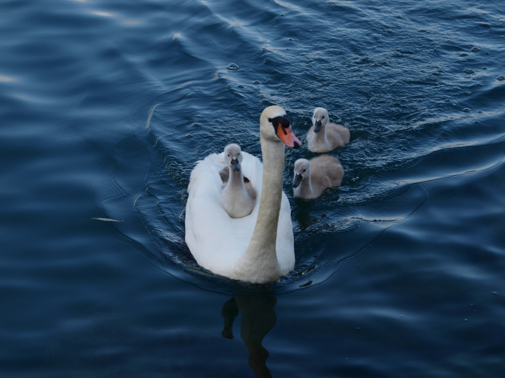

Ce sont les 3 temps de toute relation, en particulier celle de l’enfant avec ses parents. C’est vrai aussi dans un couple. Tout d’abord, il s’agit de bien établir le lien. Pour certaines personnes, le lien a manqué, le lien avec la mère ne s’est pas effectué, les contacts physiques, affectifs ont manqué.

Ces gens recherchent alors toute leur vie ce lien d’union souvent quasi fusionnel avec l’autre. C’est la recherche nostalgique de la symbiose avec la mère qu’ils ont vécue dans la vie intra-utérine. Pour beaucoup, ce lien, bien que rompu biologiquement à la naissance, les maintient toujours attachés aux parents. Bien qu’adultes ils n’ont pas réussi à délier. Ils font bien 2 personnes avec leur père, leur mère sur le plan physique, mais il y a un état d’union, d’unité fusionnelle, où l’autre et eux ne font qu’un ; ça se passe au niveau affectif et c’est inconscient : c’est une fusion de l’inconscient. Ce sont 2 inconscients qui se mélangent et qui s’appartiennent l’un à l’autre. Mais il s’agira de grandir, de naître, de sortir de ce lien, de passer à la 2e étape, l’état de différenciation. Il s’agira de délier, de séparer, de s’éloigner. Toi, tu es toi, moi, je suis moi. Comment être à la fois avec l’autre et ne pas être l’autre ? Il s’agit bien de caresser son enfant, son conjoint, de le tenir dans ses bras, mais de temps en temps dire une parole qui le nomme, qui lui dit **qui il est et qui je suis**. Lier, délier et enfin allier. L’alliance est symbolisée par le chiffre 3. Nous sommes partis du lien, de la fusion, qui mène à la séparation, à l’exil, à la distanciation, à la différenciation, au deux et à la dualité. Mais il ne s’agit pas de rester dans la dualité et d’aller vers le 3 : la liberté, l’humanité accomplie, être. Le 3 c’est l’union dans la différence. La trinité est un symbole précieux et universel une unité multivivante, une unité de relation. Dieu est trinité, le 3 dans 1 et en cela, il est relation. Le père, le fils et la relation : Le St-Esprit. Un homme, une femme et une relation : l’amour, la mère (le père), son enfant et une relation : l’amour. Le fond de l’être est relation, mais cette relation suppose la différenciation, qu’il y ait de l’espace entre les 2. L’alliance, c’est la communion et non la fusion. C’est très bien exprimé dans les évangiles par la parabole de l’enfant prodigue : un père avait deux fils. Il vivait en état d’unité, de symbiose avec eux, qui vivaient auprès de lui. Voilà que l’un d’eux réclama sa liberté et dit à son père : « donne-moi mon héritage, car je veux en profiter dès aujourd’hui et ne veux pas attendre ta mort. Le père accepta qu’il touche son héritage et qu’il parte. Ce père accepte que son fils parte de chez lui, alors qu’il fait tout pour lui, pour qu’il soit heureux, mais il lui laisse la liberté de partir, de sortir du cercle, de la ronde familiale. Cet enfant part donc et l’histoire nous raconte qu’il dépense tout son bien en vivant grand train de vie. Quand il eut tout dépensé, une grande famine survint. Il fut dans l’indigence, en état de manque, de vide; il avait épuisé toutes ses potentialités. De lui-même, il décide de retourner vers son père, c’est-à-dire, il se retourne vers lui-même, revient vers son propre cœur, son propre centre et se recentrant, il retrouve sa source, son principe, son être, son père dans le texte. Il se dit qu’auprès de son père, il était nourri. Il se rend compte que l’eau coupée de sa source croupit, stagne et s’épuise. L’eau qui reste en contact avec la source ne s’épuise pas. Réfléchissant sur lui-même, revenant en lui-même, il veut retourner vers son père et il lui dira : « je ne suis pas digne d’être appelé ton fils, traite-moi comme un de tes serviteurs, de tes mercenaires ». Il se sent dans la proximité de la source, même s’il n’a plus cette relation filiale, dont il n’est plus digne. Il se met en chemin et à sa surprise, son père vient à sa rencontre. Non seulement c’est lui qui va vers le père, mais c’est le père qui va à lui, comme si la source n’avait jamais cessé de couler vers lui, vers cette coupe qui ne cessait de s’éloigner et de se boire elle-même loin de lui. Il retrouve le père, c’est le retour de l’enfant prodigue. La source est toujours là, elle l’attend, le principe un nous est toujours offert. Il embrasse son père, qui était accouru au-devant de lui et lui dit : « je ne suis pas digne d’être appelé ton fils ». Mais le père est resté dans la même qualité d’amour, ce n’est pas parce que son fils est parti, qu’il n’est plus le père. Par contre, le fils a cessé d’être le fils, il n’est plus dans cette relation, il n’est plus digne d’être appelé son fils. Et le père lui dit : « tu n’es plus mon fils, tu es le fils de Dieu, tu es le fils de toi-même, mais tu seras traité comme mon propre fils et il dit à ses serviteurs : qu’on fasse la fête, qu’on lui mette une alliance au doigt (le symbole de l’alliance apparaît) et qu’on lui mette un habit blanc (le blanc est le signe qu’une relation nouvelle s’établit) ». Et ensuite c’est le festin, parce que ce fils que voici était mort et il est revenu à la vie. C’est la fête de l’alliance.

Comprenons bien que le récit qui nous est narré est une parabole et qu’il y a différents niveaux d’interprétation de ce texte. Il y a tout d’abord le niveau physique, biologique ; les théologiens l’appellent le niveau historico-critique. C’est le récit objectif. Ce niveau, c’est la conception de l’enfant, son développement intra-utérin (lier), puis sa naissance biologique (délier). Devenu adulte, il deviendra allié de ses parents.

Au 2e niveau, psychique celui-ci, l’être humain va ressentir très durement sur le plan affectif le déliement. Celui-ci débute à la naissance et se termine si tout va bien à l’âge adulte. Au 3e niveau, nous nous trouvons au plan spirituel, qui concerne l’inconscient collectif et cosmique. Ce sera le chemin de la voie intérieure. Au début, l’homme, l’humanité étaient dans la respiration divine, dans le jardin d’Éden.

Par la chute, il se coupe de l’information créatrice, de l’intelligence divine. Remarquez qu’identique à la parabole, Dieu nous laisse librement quitter le paradis : c’est la chute originelle. Il y a comme un voile qui tombe sur le regard de l’homme, l’empêchant de voir la vraie nature du monde et sa vraie nature. Il a délié, il vit dans la dualité, qui est la cause de notre souffrance. C’est l’affirmation de l’ego, du moi-je avec sa volonté de s’approprier l’existence. L’homme n’est plus qu’à l’extérieur de lui-même, y cherchant compensation à ce qu’il ne découvre plus à l’intérieur de lui. Il est dans l’avoir au lieu de l’être. L’avoir, la possession n’étant jamais satisfaisante (dukka), sa perte étant cause de douleurs, il va repartir à la recherche du germe divin enfouit au plus profond de lui-même et qui n’a jamais été anéanti, ni éteint. « C’est par impatience que nous avons perdu le paradis (nous avons voulu avoir le fruit de la connaissance avant de le **devenir**) et c’est par paresse que nous n’y retournons pas » dit Kafka. Il faut donc passer au 3e état, l’alliance, que Jung a appelé le processus d’individualisation, aller vers sa partie indivise, être à l’écoute du maître intérieur, de l’être essentiel.

Revenons sur le niveau psychique, car c’est peut-être là que se trouvent les situations les plus conflictuelles, les plus grandes souffrances. Prenons l’état de l’enfant qui n’est pas sorti du sein de la mère, du sein du père, et qui n’est pas sorti de l’unité sous le mode fusionnel. C’est une étape normale : l’enfant, avant d’aimer sa mère, aime un objet maternant, du lait, de la chaleur, de la sécurité. Puis par sa parole, son courage, il va exiger la liberté ; une parole qui dira : je, qui se refuse de dire nous. Je ne suis pas toi, je ne suis pas comme mon père, comme ma mère, je ne suis pas de cette famille. C’est un passage important de la maturité de l’enfant, de se révolter, de vouloir la différenciation, autrement il ne sera jamais lui-même. Il ne sera que le fils, la fille à maman, à papa, mais il ne sera pas lui, elle, moi-je. C’est un moment important de l’éducation que la mère, le père permettent à l’enfant la différenciation, la séparation, sans quoi l’enfant, l’adolescent, parfois l’adulte, va lui-même poser ses limites, se révolter ou quitter sa famille. Dans le 2e état de délier, l’ego va donc s’affirmer, éprouver l’épreuve de la liberté, des limites, de la différence. Il est important que l’être humain éprouve ce qu’il est sans l’autorité du pouvoir (parents, école, état, religion, etc.). Malheureusement très souvent, très subtilement, il reste bloqué dans le premier état ; lié non à l’état physique, bien sûr, la naissance a délié, mais au niveau psychique, affectif, inconscient, il continue à subir le lien parental. La souffrance, la maladie sont l’expression de ce combat intérieur pour délier.

L’être peut avoir réussi à délier, mais il reste dans ce 2e état, l’état d’affirmation du moi : il est alors dans la dualité, dans une souffrance permanente, un mal-être. Dans cet état, c’est l’inflation du petit moi existentiel qui peut aller jusqu’à la paranoïa. Ce doute intérieur, ce mal-être, si nous n’en sommes pas conscients, nous allons le projeter à l’extérieur. Tant que nous ne voyons pas le doute, la menace en soi, nous allons accuser l’autre de nous menacer. Si nous ne voyons pas l’ombre à l’intérieur de nous-même, nous la projetons sur l’autre, le mal c’est l’autre, c’est toujours l’autre, ce n’est jamais nous (c’est l’origine de tous les conflits, du simple conflit entre deux personnes jusqu’au conflit entre les nations). Ceci se nomme une projection. Vous avez une 2e variante, c’est la rétrojection : l’ombre, l’ennemi intérieur nous le retournons contre nous-mêmes, à défaut de l’avoir identifié : encore une cause de beaucoup de nos maladies, la cause principale du cancer, des suicides et des maladies auto-immunitaires (voir le cercle infernal).

Il est donc nécessaire de passer à la 3e étape, au 3e état, l’état d’alliance : c’est la thérapie spirituelle, c’est l’histoire de l’enfant prodigue : il s’agit de rétablir l’alliance avec son père, avec sa mère, avec sa famille.

Il s’agit d’être en harmonie avec la loi de cet univers, l’amour, d’être en relation. Je suis qui je suis, ils sont ce qu’ils sont, je n’ai pas à les juger, mais bien que je leur donne mon amour, je sais leur dire non, poser une limite et ne pas me charger d’une faute venant d’eux.

Le prolongement du scénario non résolu avec nos parents peut se retrouver au niveau du couple. Au début, l’état amoureux, la passion, c’est un état fusionnel, on retrouve le sein de la mère ; si vous voulez, c’est la nostalgie du rond, de l’homme rond et dans le ventre de notre mère, nous étions ronds. L’autre et moi nous ne faisons qu’un, on recherche cet état de fusion avec un(e) autre. Puis tôt ou tard dans nos relations de couple, nous sortons progressivement de l’un, de l’état amoureux et on entre dans le 2. La dualité amène les conflits, les affrontements, souvent résolus en revenant à l’état fusionnel. Donc dans un couple nous vivons tour à tour des moments de passion, mais aussi des temps de séparation et de dissociation. Finalement, ces situations de couple conduisent toujours à la séparation : momentanée (la brouille), plus longue (nous boudons, nous nous faisons la gueule) ou quelquefois définitive (deux mariages sur trois). Nous allons rester dans le 2 et un des partenaires va rechercher le 1, c’est-à-dire une autre personne avec qui il va faire la fusion, chercher un autre objet qui va le mettre dans un état amoureux, fusionnel et le même scénario resurgit. Mais cela ne va pas durer très longtemps et à nouveau il se retrouve à 2 dans la dualité. Il recherche encore, retournant à l’un, au rond, alors qu’à travers cette rupture, cette séparation, ces difficultés, nous arrivons à nous rendre compte que l’autre est un autre, et que l’autre ne me doit rien. L’autre a le droit de ne pas m’aimer, ce n’est pas très commode, il a le droit de ne pas m’apprécier, c’est très dur.

Il est temps que nous prenions conscience de ce qu’il y a à changer et que nous passions alors au 3e état, l’état d’alliance, d’amour, où nous perdons le goût de nous approprier l’autre. Va vers toi-même, dit le bien-aimé à la bien-aimée dans le cantique des cantiques. L’amour devient alors une dualité surmontée, le 3 dans 1 (relire la feuille sur la définition de l’amour). Nous pouvons donc être différents et en même temps vivre ensemble. Peut-être qu’il faut être très différents pour vivre ensemble, autrement quel ennui si on est pareil. Donc dans un couple qui veut durer nous devons être conscients de ces 3 états, allant de l’un à l’autre constamment.

À un autre niveau, c’est aussi notre propre histoire intérieure que nous avons évoquée plus haut : la plupart des gens vivent constamment dans la dualité, s’étonnent des souffrances que nous inflige le monde matériel, le monde de l’espace-temps et oublient de rechercher par la voie intérieure leur moi essentiel, c’est-à-dire l’alliance avec la source même, avec le principe un. C’est rétablir la relation entre le moi existentiel et le moi essentiel. C’est le moi, en quête du soi. L’important, c’est la prise de conscience de ses 3 états et que la vie est constamment mouvement, passage à travers ces 3 situations. L’important c’est de ne pas rester bloqué dans la première ou/et la deuxième sans être passé ou avoir conscience du 3e état. C’est bien là l’expérience du fils prodigue, qui croit qu’il peut exister sans l’être, mais qui revient à la source, sans oublier l’autre parole du Christ : mon père et moi, nous ne faisons qu’un, mais mon père est plus grand que moi (le paradoxe, ni séparation, ni confusion). Effectivement ce qui se manifeste dans le fleuve, ce n’est pas toute la source, ce qui se manifeste dans notre petite vie, ce n’est pas toute la vie. Ce qui se manifeste dans notre corps physique, ce n’est pas tout : nous avons à retrouver cette transparence des 3 corps et bien nous souvenir que nous sommes ces 3 corps.
