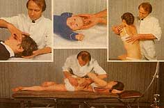

L’ostéopathie est un système de soins basé sur des techniques de manipulations douces, appliquées au niveau musculaire, vertébral, crânien, thoraco-abdomino-pelvien, ainsi que sur les membres.

C’est une méthode thérapeutique extrêmement précise, logique, rigoureuse et efficace, qui vise à supprimer des lésions, ainsi qu’à rendre et maintenir la mobilité, la souplesse et le mouvement.

Médecine complémentaire, l’ostéopathie s’intéresse non seulement aux symptômes physiques, mais aussi à l’état global du patient.

Le champ d’application est vaste. L’ostéopathie peut prendre en charge aussi bien les problèmes vertébraux que les problèmes de migraine, de dépression, les infections ORL récidivantes chez le bébé ou le jeune enfant, etc.

Le but du traitement consiste à réharmoniser les structures du corps par des techniques précises, afin de permettre le retour à la normale de la circulation des fluides et de l’énergie nerveuse.

Cette technique n’est pas proposée dans le Centre de Naturopathie Lausanne.
