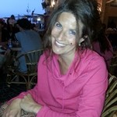

<em><strong>Audrey Vitton, réflexologue diplômée, agrée ASCA</strong></em>

<h2 id="laréflexologie">Réflexologie</h2>

La réflexologie est un massage ancestral qui se pratique sur intégrabilité des pieds. Par pressions et massages sur des zones bien précises, il vous permet de libérer les tensions du corps et retrouver un équilibre global.

Cette pratique permet aussi d’agir sur les états de stress et aussi d’améliorer les divers troubles développés dans notre vie quotidienne : insomnies, digestion difficile, anxiété, migraines, rétention d’eau, maux de dos…

Ce massage peut aussi se pratiquer sur les mains pour les personnes n’appréciant pas le contact au niveau des pieds.

<h2 id="sonothérapie">Sonothérapie</h2>

Soins par les bols tibétains, massage sonore permettant un rééquilibrage des corps physiques et énergétiques. Favorise une relaxation et un apaisement.

<h2 id="musicothérapie">Musicothérapie</h2>

La musicothérapie est un soin par le son, la vibration, le rythme et la musique, qui permet d’exprimer ses émotions et rééquilibrer le corps, le mental et l’émotionnel.

Elle permet aussi de s’ouvrir à soi-même, Être et ressentir, donc de mieux appréhender nos états d’âme.

La réflexologie et la musicothérapie/sonothérapie s’adressent à tout le monde et à tous les âges.

<h2 id="approchepsychocorporelle">Approche psychocorporelle</h2>

Cette approche, à la fois psycho émotionnelle et physique, permet d’appréhender les différents mécanismes égotiques, de sentir les tensions corporelles et de voir par rapport à ceux-ci où l’énergie est bloquée dans le corps et donc de relâcher les efforts et de la refaire circuler.

<h2 id="présentation">Présentation</h2>

Je m’appelle Audrey, je suis réflexologue diplômée de l’école Bayly Reflexology de Lausanne depuis 2007.

Je pratique la réflexologie depuis de nombreuses années, tout d’abord en France et maintenant en Suisse.

Depuis toujours intéressée par la nature humaine, ses mécanismes, ses réactions, j’ai développé à travers ces différentes approches (voir ci-dessus) des connaissances pour pouvoir vous offrir un soin selon votre demande, vos besoins et vos propres rythmes.

Je vous accueille tous les lundis avec grand plaisir à mon cabinet de Romanel sur Lausanne.

Tél. 076 682 25 01

&nbsp;

