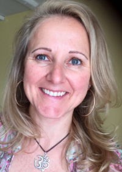
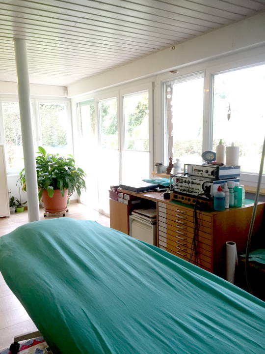
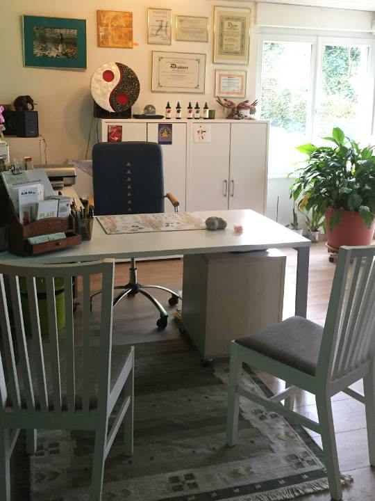
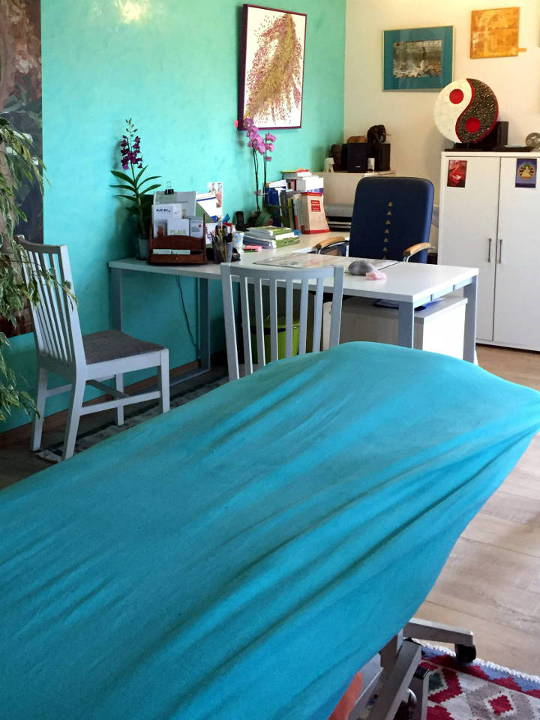

**Fabienne Jordan-Grossrieder a le plaisir de vous accueillir sur le site du Centre de Naturopathie Lausanne**

Vous y découvrirez des solutions naturelles pour maintenir, améliorer ou recouvrer votre santé.
Fabienne Jordan-Grossrieder, naturopathe et nutritionniste diplômée, pratique depuis 1993 les médecines complémentaires et exerce comme indépendante depuis 1999. Son expérience et les formations continues qu’elle suit régulièrement lui permettent d’avoir une palette d’outils qu’elle peut utiliser en fonction des besoins de chacun et dans des domaines aussi vastes que les troubles digestifs, les allergies, les maux de dos, les migraines, les maladies chroniques, etc. Elle donne également régulièrement des conférences sur la prévention des maladies hivernales et les problèmes féminins.

La médecine complémentaire peut toujours aider, améliorer, voir permettre au patient de se débarrasser des symptômes, pour autant qu’il le décide et s’investisse dans sa prise en charge.

Fabienne Jordan-Grossrieder a eu la chance de travailler et collaborer avec Roland Carriot, naturopathe et ostéopathe de grande expérience et pionnier dans ces domaines en Suisse romande. Il s’était engagé et dévoué pour une reconnaissance légale de la profession de naturopathe et d’ostéopathe auprès des autorités cantonales et fédérales, au travers de l’APTN – *Association des Praticiens en Thérapeutiques Naturelles*. Malheureusement, son décès durant l’été 2008 a mis fin à cette belle collaboration, mais son esprit est toujours présent grâce au centre de naturopathie et tout le savoir qu’il a bien voulut partager et transmettre à bien des thérapeutes et patients.

## Pratiques

<ul>
<li><a href="javascript:void(0);"              >Bilan de santé</a></li>
<li><a href="/therapies/naturopathie/"         >Naturopathie</a></li>
<li><a href="/therapies/hygiene-vitale/"       >Nutrition – Hygiène de vie</a></li>
<li><a href="/therapies/phytotherapie/"        >Phytothérapie</a></li>
<li><a href="/therapies/aromatherapie/"        >Aromathérapie</a></li>
<li><a href="/therapies/spagyrie/"             >Spagyrie</a></li>
<li><a href="/therapies/sympathicotherapie/"   >Sympathicothérapie</a></li>
<li><a href="/therapies/veinologie/"           >Veinologie</a></li>
<li><a href="/therapies/massage-therapeutique/">Massage thérapeutique – vertébrologie</a></li>
<li><a href="/therapies/massage-ayurvedique/"  >Massage ayurvédique</a></li>
<li><a href="/articles/allergie/"              >Traitement des allergies, méthode NAET</a></li>
<li><a href="/therapies/reflexologie/"         >Réflexologie podale</a></li>
<li><a href="/therapies/drainage/"             >Drainage lymphatique</a></li>
<li><a href="/therapies/bioresonnance-mora/"   >Biorésonnance avec appareil MORA</a></li>
</ul>

