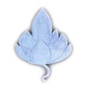

<h2 style="text-align: center; line-height: 2em;">
Thérapies de l’Âme 
Transmission 
des paroles 
de l’Ange
</h2>

&nbsp;

Si vous ne savez plus que penser de votre vie, que décider, que comprendre des épreuves que vous vivez, comment résoudre vos problèmes.

Si vous souffrez de comportements répétitifs inadéquats ou dérangeants.

Si vous décidez de vous défaire d’une peur ou d’une phobie, prenez du temps pour vous consacrer à vous-même et vous défaire de cela...

Vous êtes les bienvenus et vous trouverez de plus amples explications sur mon site :

&nbsp;

<a title="anges.ch" href="http://anges.ch">anges.ch</a>

&nbsp;

<a href="http://anges.ch">  Martine Bergamin</a>

