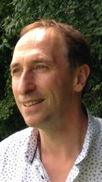

&nbsp;

&nbsp;

  <em><strong>Philippe Gamondès, Nutritionniste, Médecine chinoise</strong></em>

&nbsp;

> “Que ton aliment soit ton premier médicament”

Nous rappelle Hippocrate depuis 450 ans av. J.-C.

D’où l’importance d’une correction alimentaire quand “nous ne sommes pas très bien dans notre assiette”. Cette correction se doit d’être conforme à nos rythmes chronobiologiques et à nos capacités physiologiques.

Titulaire d’une licence en nutrition et micronutrition de l’université de Poitiers, je m’appliquerai à répondre à vos attentes avec “soin”.

Si une modification alimentaire s’impose, elle ne pourrait se faire sans une approche énergétique multimillénaire qu’est la médecine traditionnelle chinoise.

Cette lecture énergétique est le socle de ma pratique de part sa pertinence et son ancienneté à identifier la cause des déséquilibres au-delà d’une lecture symptomatique.

J’ai commencé une formation en médecine traditionnelle chinoise en 1991, ce qui m’a permis de rencontrer et de travailler pendant 10 ans avec un médecin chinois, également chirurgien.

La bible de la médecine chinoise est le livre de l’Empereur jaune, le Su wen, 2500 ans av. J.-C. qui stipule l’importance de se nourrir et de se soigner avec des aliments et des plantes issus de notre région.

D’où la nécessité d’harmoniser notre assiette et notre énergie afin d’aiguiller le corps à vivre et à revivre en santé.

Consultation tous les vendredis à Romanel s/Lausanne, tél. +41 79 943 82 11

## Le soin énergétique chinois {#lesoinénergétiquechinois}

Le soin énergétique chinois fluidifie et harmonise la circulation de l’énergie qui nourrit notre structure biologique, nos organes et notre équilibre émotionnel.

Ce flux énergétique se stimule grâce à différentes techniques manuelles et énergétiques telles que l’acupuncture, l’acupressure, la moxibustion, les ventouses, le tui-na et le Qi Gong… Ces différentes approches défont les nœuds énergétiques entravant cette libre circulation et libèrent le corps de sa douleur, de son mal-être et de ses blocages.

Le soin énergétique chinois que je pratique se déroule en trois étapes :

  * L’interrogatoire : le motif de la consultation, tous les symptômes corporels et émotionnels ressentis
  * L’observation : l’état général de la personne se reflète sur le teint, la langue, la peau, les ongles, les cheveux, la modulation de la voix, les soupirs, la posture…
  * L’auscultation-palpation : prise des pouls chinois, température des zones du corps

Ce soin se reçoit habillé, il est donc important d’avoir des habits souples et confortables. Le soin consiste à stimuler ou calmer des points énergétiques sur l’ensemble du corps correspondant à des organes, à des fonctions organiques et à des émotions en relation avec le motif de la consultation.
