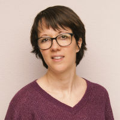

J’ai le plaisir de vous annoncer ma collaboration avec Fabienne Grossrieder à Romanel au Centre de Naturopathie Lausanne (CNL).

Après une formation de base d’assistante en pharmacie, j’ai travaillé durant 14 ans dans le domaine des assurances maladie. Maman de trois enfants, j’ai décidé de faire une pause à la naissance de ma petite dernière. Une période de transition qui m’a permis de me réorienter vers un nouvel avenir professionnel.

Passionnée par le toucher et le contact humain j’ai débuté une formation d’instructrice en massage pour bébé et enfant en 2018. Puis le désir de poursuivre mes connaissances m’a conduite à débuter une formation de réflexologue.

Diplômée depuis décembre 2019, j’exerce aujourd’hui avec passion ma nouvelle profession de thérapeute en réflexologie générale.

Actuellement je suis en formation pour le certificat de branche en réflexothérapie. Cette formation me permettra de vous apporter de nouvelles techniques et de parfaire encore plus mes connaissances.

Pour plus d’informations retrouvez-moi sur [www.reflexologue-therapeute.ch](https://reflexologue-therapeute.ch).

Au plaisir de vous recevoir,

Stéphanie
