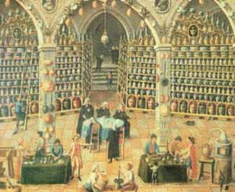

La salle de réception d’une pharmacie. Pendant de nombreuses années, les pharmaciens d’Europe ont analysé et enregistré les propriétés médicinales de beaucoup de nouvelles huiles essentielles.

L’aromathérapie est un domaine spécial de la phytothérapie (traitement par les plantes) qui se sert des substances aromatiques végétales, appelées huiles essentielles, dans un but médicinal.

Elle est une méthode de traitement vieille de plusieurs millénaires. Les vertus des huiles essentielles et des résines étaient déjà connues des Égyptiens, qui les utilisaient pour des rituels, pour traiter des maladies, pour les soins cosmétiques et pour l’embaumement.

Comme beaucoup de thérapies naturelles, l’aromathérapie connaît ces derniers temps une vraie renaissance.

L’extraction des substances aromatiques se fait surtout selon trois procédés : la distillation à la vapeur, l’expression à froid par simple pression mécanique et l’extraction au moyen de solvants organiques, lesquels sont ensuite éliminés par distillation sous vide. La quantité de plantes nécessaires (de quelques kilos à plusieurs tonnes pour certaines), son rendement, sa qualité, sa provenance définissent son prix. Par exemple, il faut 6 à 7 kilos de clous de girofle, ou 150 kilos de lavande vraie, ou 4 tonnes de pétales de roses de Damas, pour obtenir 1 litre d’huile essentielle.

Les huiles essentielles sont l’âme des plantes, et chacune possède sa propre identité, sa propre personnalité. Elles contiennent une grande concentration d’énergie vitale.

Leurs propriétés sont globalement :

  * antiseptiques, voire antibiotiques, c’est-à-dire qu’elles détruisent les micro-organismes, ou tout au moins elles inhibent leur croissance
  * antivirale : l’expérience a clairement démontré leur effet positif sur les maladies virales, en particulier le zona, l’herpès et la grippe
  * anti-inflammatoires
  * cicatrisantes et régénératrices cellulaires
  * mucolytiques : elles facilitent la liquéfaction des mucosités et des glaires
  * expectorantes
  * stimulantes, fortifiantes, excitantes
  * antispasmodiques : elles agissent au niveau du système nerveux en aidant à éliminer les tensions, le stress et les spasmes
  * tranquillisantes, sédatives, relaxantes
  * antiallergiques (comme la camomille bleue, le bois de cèdre, etc.)
  * toxiques : il ne faut pas oublier la toxicité de certaines huiles essentielles qui doivent être utilisées avec précaution (armoise, sarriette, thuya, etc.)

Les huiles essentielles sont très rapidement absorbées par l’organisme, mais sont également très vite éliminées. Elles ont donc un effet rapide et de courte durée. Une utilisation à long terme est parfois déconseillée en raison des propriétés toxiques de certaines huiles.

Dans un but thérapeutique, elles sont utilisées de diverses manières :

  * par diffusion atmosphérique ou par inhalation
  * par la peau, en application directe, en massage, en compresses, avec les bains
  * par la bouche, en gouttes ou en gélules
  * par les intestins sous forme de suppositoires
  * par les voies génitales sous forme d’ovules

Des critères de qualité sont indispensables et le mode de prescription est décisif pour une bonne efficacité de traitement.
