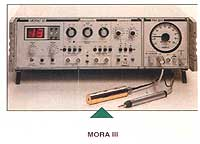

La biorésonnance avec appareil MORA est une technique de biophysique médicale fondée sur l’utilisation et la correction des oscillations électromagnétiques captées sur les méridiens et points d’acupuncture du patient lui-même, au moyen de l’appareil MORA.

L’appareil MORA capte les signaux physiologiques et les signaux pathologiques perturbateurs du patient. Il les transforme en oscillations correctrices, puis il les restitue au patient. Les énergies pathologiques sont ainsi éliminées, tandis que les oscillations physiologiques sont renforcées.

La logique du système MORA est celle de la réalité : tout est longueur d’onde. Le MORA permet ainsi d’obtenir des résultats spectaculaires là où d’autres techniques ont échoué ou auraient réclamé des traitements de longues durées.

Il peut couvrir toutes les indications habituelles de la naturopathie, en particulier :

  <ul>
    <li>
      L’existence d’une perturbation énergétique de certaines fonctions physiologiques ou organes.
    </li>
    <li>
      L’identification et le traitement de l’ALLERGIE.
    </li>
    <li>
      La détection de foyers infectieux (sinusite, granulome, etc.).
    </li>
    <li>
      La détection de lésions ostéopathiques.
    </li>
    <li>
      La détection et la levée des perturbations cicatricielles.
    </li>
    <li>
      L’identification et le traitement des intoxications diverses : médicaments, suites de vaccinations, bijoux, aliments, additifs alimentaires, produits divers, etc.
    </li>
    <li>
      Le dépistage des métaux et produits dentaires toxiques
    </li>
    <li>
      La mesure des différences de potentiel en dentisterie
    </li>
    <li>
      La sélection individuelle des remèdes en naturopathie et choix des dilutions homéopathiques correctes adaptées au patient
    </li>
  </ul>

