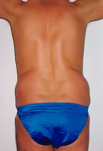
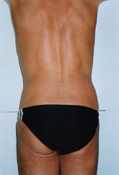
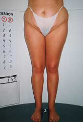
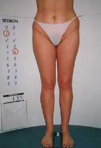
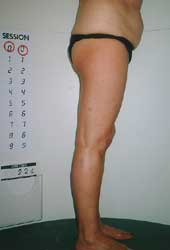
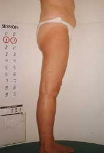

L’endermologie est une technique non chirurgicale, crée au début des années 1980 par LPG System, afin de manipuler en douceur le tissu cutané et sous-cutané. Elle se pratique avec un appareil, le CELLU M6, sur le principe d’aspiration-enroulement-déroulement.

## Le massage aux multiples bénéfices

<ul>
<li>Réduction de la cellulite</li>
<li>Harmonisation de la silhouette</li>
<li>Augmentation nette de la tonicité des tissus</li>
<li>Amélioration le l’aspect et de la qualité de la peau</li>
<li>Amélioration de la circulation lymphatique et sanguine</li>
<li>Renforcement d’une cure, d’un régime et d’une phase d’élimination</li>
</ul>
</td>
<td>
<ul>
<li>Traitements des cicatrices et des brûlures</li>
<li>Réduction des douleurs musculaires</li>
<li>Facilitation de la récupération après un effort physique</li>
<li>Traitement des pathologies sportives</li>
<li>Effet relaxant et antistress</li>
</ul>

L’endermologie ne fait pas maigrir toute seule, mais accompagnée d’une bonne hygiène de vie, la silhouette s’affine, se redessine et se tonifie indéniablement.

Ici, la technologie appuyée par la naturopathie permet une approche globale du corps et un traitement spécifique pour chacun.

L’endermologie est une méthode globale de soins, élaborée à partir des connaissances scientifiques du tissu conjonctif. Elle a fait ses preuves dans les transformations accidentelles du tissu conjonctif, les brûlés, les cicatrices, les oedèmes traumatiques et la cellulite.

Les transformations acquises du tissu conjonctif, avec ou sans connotation esthétique préoccupante, ont la même base anatomo-physiologique que les atteintes accidentelles, et elles sont traitées avec la même rigueur par l’endermologie.

Ce procédé permet de relancer la vascularisation des tissus engorgés. La graisse est dans un premier temps désorganisée, puis à long terme déstructurée, ce qui permet aux adipocytes (cellules graisseuses) de se vider de leur graisse. En débloquant ces barrages circulatoires, le capiton fond dans la masse. L’élimination des toxines dans les tissus est facilitée, ce qui aide et soutient énormément une phase de régime et de drainage de l’organisme. Ainsi, d’une manière générale, la silhouette s’affine indéniablement et surtout sur les zones sensibles comme la culotte de cheval, les fessiers, l’entre cuisse, les genoux. Cette technique permet également de traiter les contusions musculaires, les cicatrices (juste après une opération pour éviter des chéloïdes et des adhérences), les oedèmes (jambes lourdes, troubles circulatoires superficiels) sans abîmer les capillaires déjà apparents ; bien au contraire, ça les renforce.

## Photos de patients traités par l’endermologie et suivant une alimentation équilibrée

&nbsp;

<h3>Cas 1</h3>
<table>
<colgroup>
<col width="180px" />
<col width="180px" /></colgroup>
<tbody>
<tr>
<td></td>
<td></td>
<td>
<h4>Descriptif</h4>

Homme 38 ans 
16 séances 
Poids : -11 kg en 5 mois 
Taille : 99 - 11 = 93 cm 
Ombilic : 106 - 13 = 93 cm 
Fessier : 102 - 7 = 91 cm</td>
</tr>
</tbody>
</table>

&nbsp;

<h3>Cas 2</h3>
<table>
<colgroup>
<col width="180px" />
<col width="180px" /></colgroup>
<tbody>
<tr>
<td></td>
<td></td>
<td>
<h4>Descriptif</h4>

Femme 34 ans 
Poids : -10 kg en 6 mois 
Taille : 84.5 - 12 = 72.5 cm 
Fesses : 104.5 - 12 = 92.5 cm 
Cuisse : 59 - 6 = 53 cm 
Culotte de cheval : 97.5 - 7.5 = 90 cm</td>
</tr>
</tbody>
</table>

&nbsp;

<h3>Cas 3</h3>
<table>
<colgroup>
<col width="180px" />
<col width="180px" /></colgroup>
<tbody>
<tr>
<td></td>
<td></td>
<td>
<h4>Descriptif</h4>

Femme 55 ans 
Poids : -8 kg en 4 mois 
Thorax : 89.5 - 8.5 = 81 cm 
Ceinture : 92.5 - 7.5 = 85 cm 
Hanche : 107 - 8 = 99 cm 
Fessier : 104 - 6 = 98 cm 
Cuisse : 54 - 2.5 = 51.5 cm 
Culotte de cheval : 97 - 2.5 = 51.5 cm</td>
</tr>
</tbody>
</table>
