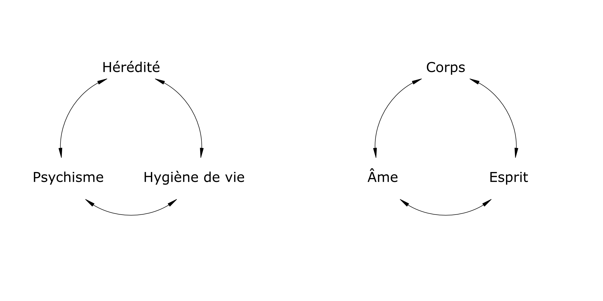

L’hygiène vitale est un ensemble de moyens et de pensées pour aider l’homme à vivre harmonieusement, physiquement et psychiquement dans son environnement.

Pythagore au 6e siècle avant Jésus-Christ professait déjà que la plus noble tâche qu’on puisse proposer ici-bas était d’apprendre aux hommes à vivre. Il considérait la santé comme une harmonie et la maladie comme une rupture d’équilibre.

L’hygiène vitale tient compte de l’importance des lois de la Vie à disposition de chacun ; mais dont souvent nous en sous-estimons ou ignorons l’importance :

<ul>
<li>Alimentation – Nutrition</li>
<li>Air – Eau – Soleil</li>
<li>Contact avec des matières</li>
<li>Activité physique – Sédentarité</li>
<li>Travail – Repos</li>
<li>Habitat – Environnement</li>
<li>Équilibre psychoaffectif</li>
<li>Spiritualité</li>
</ul>

## Les lois de la vie

Les problèmes physiques d’une vie correspondent à ses problèmes psychiques, et ces deux ordres de problèmes correspondent à ses problèmes spirituels.

On ne peut guérir le corps sans soigner l’âme et l’esprit. Il n’y a pas de réforme morale sans réforme spirituelle (Dr Paul Tournier, Médecine de la Personne, Éd. Delachaux & Niestlé).

Pour Hippocrate, c’est la nature qui guérit, c’est-à-dire la force vitale que Dieu donne à l’homme. « Quand on est tombé malade, écrit-il, il faut changer de manière de vivre, car il est clair que celle qu’on suivait est mauvaise en tout, ou en grande partie, ou en quelque chose ».

En naturopathie, le rôle du thérapeute est d’enseigner les lois de la Vie en responsabilisant le patient par une prise de conscience de son hygiène de vie en fonction de son tempérament et de son environnement. Il s’efforce de trouver pour chacun la meilleure approche pour une meilleure qualité de vie physique et psychique.

