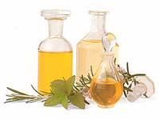
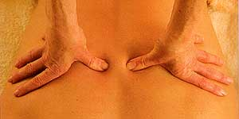

Le massage est vieux comme le monde. C’est l’expérience du toucher, primordiale et pourtant si négligée par notre civilisation. C’est le 1er contact de l’enfant, les gestes qui réconfortent, la main qui frictionne instinctivement l’endroit douloureux. Tout le monde à besoin de se détendre, d’échapper à la tyrannie du temps et, pourtant, nous restons maladroits face à ce mode de communication.

Le moment est venu de retrouver l’équilibre, d’éliminer les douleurs, les courbatures, les tensions et le stress du quotidien. Un bon massage joue à tous les niveaux de notre être. Sur le plan physique, ses avantages sont la détente et le renforcement de notre tonus musculaire ; la stimulation de notre circulation veineuse et lymphatique ; l’oxygénation des tissus ; l’assouplissement des articulations. Sur le plan psychique, il procure bien-être, confiance et joie. Il permet également de libérer les tensions accumulées dues au stress. Il apprend à connaître, habiter et ressentir notre corps.

Dans le massage aromatique, l’effet guérisseur du toucher est amplifié par les vertus des plantes. Le massage aux huiles essentielles est la voie royale de tous les traitements aromatiques.
