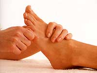

La réflexologie se fonde sur le principe qu’il existe des zones ou des points réflexes sur les pieds et les mains, qui correspondent chacun à un organe, une glande ou une structure du corps. En stimulant les zones réflexes des pieds ou des mains, cela produit une réaction biochimique via le système nerveux sur l’organe cible (estomac, foie, reins, etc.) et permet ainsi d’éliminer des blocages, de retrouver la santé.

La réflexologie détend, réduit les tensions, améliore la circulation du sang, stimule le système nerveux, rétablit l’harmonie et l’équilibre. Comme la plupart des maladies actuelles proviennent du stress, la réflexologie apporte bien des améliorations.

Le Dr Manzanares a approfondi la réflexologie conventionnelle, élaboré une technique et une carte très précise des pieds. Fruit de 20 ans de recherches scientifiques basées sur plus de 70’000 cas cliniques, préalablement diagnostiqués par les méthodes conventionnelles, la réflexologie podale se veut thérapeutique, pratique et efficace.

Le Dr Manzanares, de Barcelone (Espagne), a effectué des biopsies sur les dépôts et cristaux formés par une trame du tissu conjonctif de l’hypoderme du pied permettant ainsi de définir la cartographie des zones réflexes du pied. Voici les résultats :

&nbsp;

<table style="width:100%;">
<tbody>
<tr>
<td></td>
<th>Biopsie normale 
sans dépôts</th>
<th>Biopsie 
avec dépôts</th>
</tr>
<tr>
<td>Fibres nerveuses</td>
<td>8 %</td>
<td>42 %</td>
</tr>
<tr>
<td>Vaisseaux</td>
<td>27 %</td>
<td>28 %</td>
</tr>
<tr>
<td>Tissu conjonctif</td>
<td>65 %</td>
<td>30 %</td>
</tr>
</tbody>
</table>

&nbsp;

La réflexologie podale permet de travailler les différents systèmes (nerveux, circulatoires, ostéo-articulaire, digestif…) selon un protocole précis en fonction de chaque pathologie.
