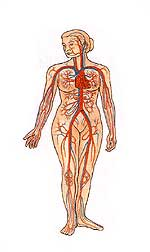

80 % des femmes et 40 % des hommes présentent des troubles liés à l’insuffisance veineuse : 10 % se soignent !

La veinologie est une méthode thérapeutique globale destinée à traiter les troubles liés à l’insuffisance veineuse et lymphatique. Les indications sont :

<ul>
<li>Jambes lourdes</li>
<li>Œdèmes veino-lymphatiques</li>
<li>Hypodermite et eczématisation</li>
<li>Prévention des thromboses</li>
<li>Fragilité des capillaires (télangiectasies)</li>
<li>Varices et ulcères variqueux</li>
<li>Hématomes</li>
<li>Prévention des phlébites</li>
</ul>

La veinologie permet d’avoir réellement des effets curatifs visibles et durables. Le traitement comprend :

  * Bilan de l’insuffisance veineuse et les solutions préventives et curatives.
  * Prescription en phytothérapie.
  * Conseils en nutrition et hygiène de vie.
  * Utilisation de l’aromathérapie.
  * Traitement par la dermo-aspiration/endermologie LPG.
  * Traitement par le Data Vein, premier appareil sélectif de stimulation externe des systèmes veineux et lymphatique. Le stimulus effectue un massage physiologique superficiel et profond permettant l’élimination des stases, l’amélioration des facteurs sanguins et la récupération durable du tonus de la paroi veineuse.

## Action du Data Vein

  * Accélération de la vitesse du sang, du débit veineux et du flux lymphatique.
  * Augmentation du diamètre interne des veines.
  * Activation de la fibrolyse des thromboses.
  * Renforcement des fibres musculaires de la média veineuse par stimulation des récepteurs nerveux.
  * Accélération de la perfusion d’oxygène et de glycogène.
